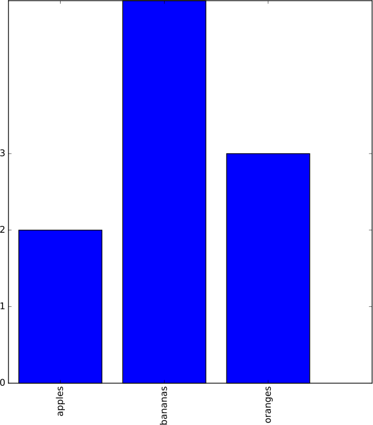

=====
About
=====

.. image:: https://travis-ci.org/povilasb/pycollection-pipelines.svg?branch=master
.. image:: https://www.quantifiedcode.com/api/v1/project/7913d23626d3406fa334a88e962d8529/badge.svg
  :target: https://www.quantifiedcode.com/app/project/7913d23626d3406fa334a88e962d8529
  :alt: Code issues

Experimental `collection pipeline <http://martinfowler.com/articles/collection-pipeline/>`_
pattern implementation in python.

.. code-block:: python

    cat('/tmp/file.txt') | filter('some line') | filter('some line 2') | out()

.. contents:: :local:

.. note::

    Library only works on Python 3.  There are no plans to support previous
    python versions.

Usage
=====

Every pipeline has a data source (**cat()**, **http()**, etc.) and an optional
data transformation/filtering and output processors.

::

         Source        Transformations      Output
    +---------------+----------------------+-------+
    |               |                      |       |
    v               v                      v       V
     echo('1.2.3.4') | split('.') | count() | out()

You can save a partial pipe and reuse it later.

.. code-block:: python

    from collection_pipelines import *

    word_list = echo('word1 word2 word3') | words()
    word_list | out() # will print the words to stdout

    word_list | filter(word2) | freq() | bar() # will draw a bar chart for word frequencies

Reference
=========

Sources
-------

**cat(file_name)**
  Reads the specified file. Sends items to the pipe line by line.

**echo(text)**
  Sends the specified text to the pipe.

**http(url)**
  Sends HTTP GET method to the specified URL and puts the response body to pipe.

Transformers, Filters
---------------------

**filter(value)**
  Filters out the items that match the specified value.

**head(N)**
  Passes only the first N items through the pipe.

**tail(N)**
  Passes only the last N items through the pipe.

**count()**
  Calculates the incoming items. When the pipeline source signals the end
  of the items, *count()* sends a single item - numbers of items, to the
  pipe.

**freq()**
  Calculates how many times each unique item appears on the pipe.
  When the source signals the end of the items, every unique item is
  sent together with it's repetition count.
  *freq()* outputs tuples: *('item_x', 8)*.

**unique()**
  Filters out the duplicate items.

**json(path)**
  Parses incoming items as json strings, extracts elements with the
  specified json path and sends them trough the pipe.
  E.g. let's say we have json '{"name": {"first": "Bob"}}' and we want to
  extract the first name.
  Then *path* would be "name.first".

**split(delimiter)**
  Splits the incoming items by the specified delimiter.
  Sends the resulting items through the pipeline one by one.

**words(text)**
  Splits the incoming text items into words and sends each word through
  the pipe.

Output Processors
-----------------

**out()**
  Outputs items to stdandard output.

**value()**
  Returns the collected items rather than outputting them somewhere.
  Useful when you want to store resulting pipeline items to variable.
  If more than one item passes the pipeline, the array of those items is
  returned.

**line()**
  Collects all items and draws a line chart.
  Items must be tuples where first item is X axis value, and second item
  is Y axis value.
  Chart is plotted using matplotlib.

**bar()**
  Collects all items and draws a bar chart.
  Items must be tuples where first item is X axis value, and second item
  is Y axis value.
  Chart is plotted using matplotlib.

**wordcloud()**
  Collects all text items and draws a word cloud.
  See: https://github.com/amueller/word_cloud

Development
===========

If you want to write your own sources, transformers or outputs there's
couple of base classes you should get familiar with.

Let's implement a very basic filter that forwards only even numbers.

.. code-block:: python

    from collection_pipelines import *

    class even(CollectionPipelineProcessor):
        def process(self, item):
            if isinstance(item, int):
                if item % 2 == 0:
                    self.receiver.send(item)

    echo([1, 2, 3]) | even() | out()

Sources
-------

Every source object must extend the *CollectionPipelineSource* class and
implement the *on_begin()* method.

E.g. this source will send random integer to a pipeline:

.. code-block:: python

    import random

    class rand_int(CollectionPipelineSource):
        def on_begin(self):
            self.receiver.send(random.randint(0, 1000))
            self.receiver.close()

Transformers, Filters
---------------------

Every transformer and filter is a python object that instantiates a class
that extends *CollectionPipelineProcessor* class.
All the work is done in *process()* method.
This methods receives an item passing the pipeline.

You might either ignore, transform or simply pass forward the items.
To send item further to the pipe use *self.receiver.send(item)*.

E.g. if you wanted to multiply all items, you could implement the method
like this

.. code-block:: python

    def process(self, item):
        self.receiver.send(item * 2)

Output processors
-----------------

Pipeline output processors must extend the *CollectionPipelineOutput* class.
Output processors are special in a way that they don't forwards the items
any further. They trigger the pipeline execution.

Implementing an output processor is very similar to implementing a transformer.

.. code-block:: python

    class stdout(CollectionPipelineOutput):
        def process(self, item):
            print(item)

Such processor would print an item as soon as it received one.
There's also a special method *on_done()*, which is called when all items
in the pipeline are processed.

E.g. if you wanted an output processor to print items only when you received
all of them, the class would look like

.. code-block:: python

    class stdout(CollectionPipelineOutput):
        def __init__(self):
            self.items = []

        def process(self, item):
            self.items.append(item)

        def on_done(self):
            for item in self.items:
                print(item)

More Samples
============

Bar Chart
---------

.. code-block:: python

    echo([('apples', 2), ('bananas', 5), ('oranges', 3)]) | bar()

Line Chart
----------

.. code-block:: python

    echo([(1, 10), (2, 7), (3, 5), (4, 5), (5, 8)]) | line()

Word Cloud
----------

.. code-block:: python

    cat('README.rst') | wordcloud()

